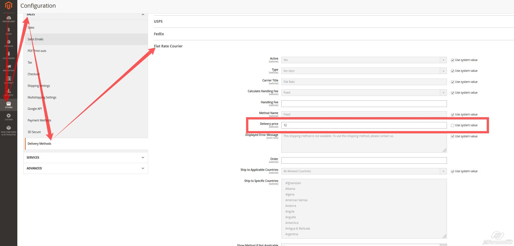

# Shipping/FlatRate - moduł dodający nową metodę wysyłki, z możliwością konfiguracji w panelu administracyjnym

Nie było dla mnie jasne czy zadanie polegało skonfigurowaniu istniejącej natywnie w Magento metody "Free Shipping", czy stworzeniu nowej metody.
W rezultacie wybrałem tą drugą opcję.
Konfiguracja z panelu admina: Stores->Configuration->Sales->Delivery Methods->FlatRateCourier

Konfiguracja kosztu wysyłki w polu "Delivery price"

#Shipping/DeliveryCost - moduł dodający blok product.shipping.cost do strony produktu zawierający koszt wysyłki dodanej wcześniej metosy FlatRate

**\app\code\Shipping\DeliveryCost\view\frontend\layout\catalog_product_view.xml** -  dodanie bloku z kosztem wysyłki
**\app\code\Shipping\DeliveryCost\view\frontend\templates\shipping_cost.phtml** - szablon HTML wyświetlający koszt wysyłki
**\app\code\Shipping\DeliveryCost\Block\ShippingCost.php** - logika bloku wyciągająca koszt wysyłki ze wskazanej metody oraz symbol waluty

